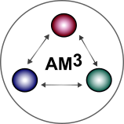

.. AM3 test documentation documentation master file, created by
   sphinx-quickstart on Sat Sep 23 17:52:17 2023.
   You can adapt this file completely to your liking, but it should at least
   contain the root `toctree` directive.

*********************************************************************
Welcome to the AM3 (Astrophysical Multi-Messenger Modeling) Software!
*********************************************************************

AM3 is a software package for simulating lepto-hadronic interactions in astrophysical environments.
It solves the time-dependent partial differential equations for the energy spectra of electrons, positrons, protons, neutrons, photons, neutrinos as well as charged secondaries (pions and muons), immersed in an isotropic magnetic field. Crucially, it accounts for the fact that photons and charged secondaries emitted in electromagnetic and hadronic interactions feed back into the interaction rates in a time-dependent manner, therefore grasping non-linear effects including electromagnetic cascades. 

Among the state-of-the-art multi-messenger simulation tools [see Cerruti et al PoS ICRC2021 979 (2021)] AM3 is the most computationally efficient, making it possible to scan vast source parameter scans and fit the observational data. It has been deployed to explain multi-wavelength observations from blazars, gamma-ray bursts and tidal disruption events, for a full list of references using AM3 see :ref:`below<(Inextensive) list of papers based on AM3:>`.

In this open-source release, we are making AM3 available with all its current features. The solver consists of a C++ library that can be compiled and deployed directly. Alternatively, we provide Python users with an interface that allows you to compile a shared library exposing all of AM3's high-level functions to Python 3. This means you can run simulations with AM3 in pure Python without any significant loss of efficiency.

If you are using AM3, please cite the following reference:

(Inextensive) list of papers based on AM3:
******************************************
.. include:: list_of_papers.txt

.. toctree::
   :maxdepth: 2
   :hidden:

   installAM3.md
   examples/simple_example
   code_overview.md
   processes_details.md
   examples/detailed_example
   running_from_cpp.md

